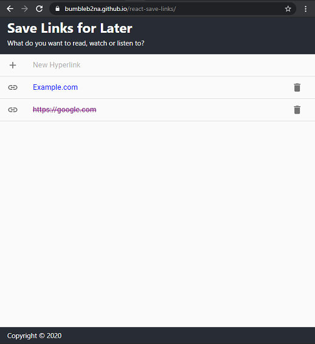

# Save Links For Later

Web app to quickly save links to a list for later. [View demo](https://bumbleb2na.github.io/react-save-links).

Add a new hyperlink to a list. When links open in browser they are flagged as visited.

[](./screenshots/react-save-links-screen1.png)

React app built with Create React App. Uses Material UI.

## Setup

```bash
npm install
npm start
```

## Testing

```bash
npm test
```

## Decisions / Plan

* Is this project for a reusable component or is it for a project such as a Single Page Application (SPA)? 

    *Reusable component because, we want to use it in other projects.*
* Do we plan to use a state management library like Redux? 

    *No because, this is intended to be a reusable component in other projects.*
* Where should data be stored?

    1. *The links can be considered sensitive data so, if storing data locally avoid avoid localStorage and use IndexedDb for better front-end security*
	2. *Since this is a reusable component we may want to make it configurable to use either GraphQL or REST Api but, we will assume REST Api for now; Build the Api as a Data Layer which could be adapted later to support either REST Api or GraphQL*
* Should we build components as controlled or uncontrolled?

    *Controlled from the List component because,*
  * *We want to perform List CRUD operations at the List level, which includes updating or deleting list items.*
  * *We want to call a REST Api from the List Level for CRUD operations.*
  * *We want to assume Api will be successful to update UI before Api returns data.*
  * *We're not using a state management library like Redux.*
* Use a front-end UI framework like Material UI? 

    *Material UI because, we want to use Google Material Design.*
* Use a preference towards React component classes or, preference to React hooks with functional classes? 

    *React hooks because,*
  * *Material UI has preference to hooks.*
  * *React team encourages use of hooks for developing new components.*
  * *We want to make child components as reusable as possible and hooks can help.*

* Will be bootstrap the app on creation?

    *Yes, we will use Create React App. We will add in Material UI manually because could not find a suitable template. If we choose Redux later on and decide to rebuild this, there is a recent template that combines Typescript, Redux and Material UI.*

* Will there be unit tests?

    *Yes, we'll use React Testing Library and Jest. These are both recommended by React and come bundled in an app created using Create React App.*
